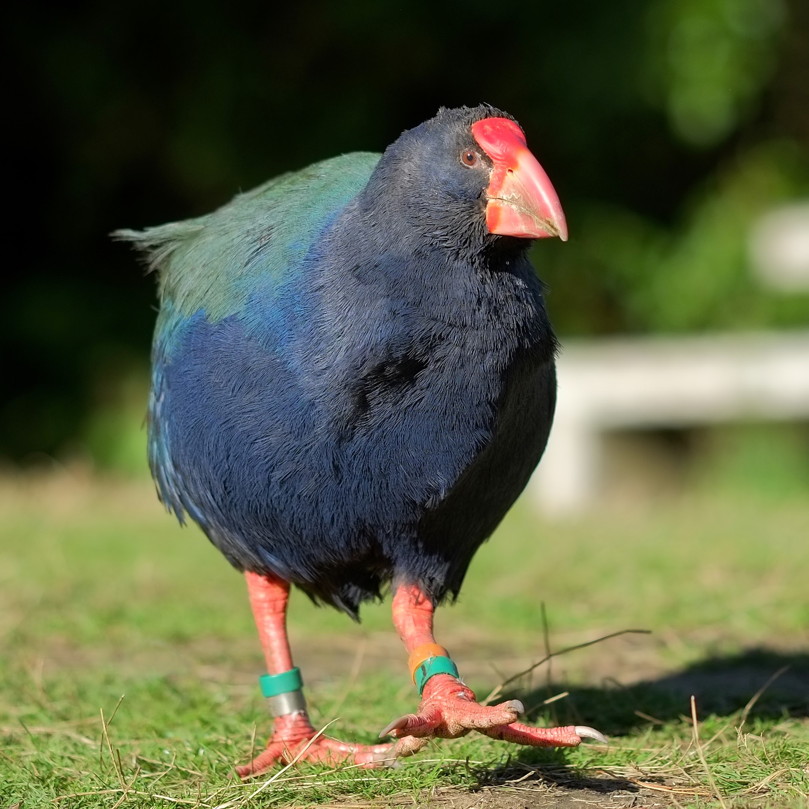

# TAKAHE - 40A v1.0

  

 

The TAKAHE *(taa-kaa-hey)* is a compact, all-in-one, control and power platform deisgned to be the heart of your robot, removing setup headaches so you can focus on building and battling. 
It combines two AM32 brushless outputs into a high-performance differential drive system, simmilar to the [Snipe](https://github.com/cb-repo/P037-SNIPE-40A), while also including the twist-lock power switching, switched auxilary power output, auto protocol detection from the direct radio input, configurable high-power BEC, and servo/signal outputs from the [Kakapo](https://github.com/cb-repo/P031-KAKAPO-20A) system. All resulting in an elegant and streamlined electronics system without compromise.

The product is named after the [Takahē](https://en.wikipedia.org/wiki/Takah%C4%93), a rare but resilient flightless bird endemic to New Zealand.

Developed, assembled, and tested in [Christchurch, New Zealand](https://www.google.co.nz/maps/place/Christchurch+New+Zealand), by Connor Benton.
